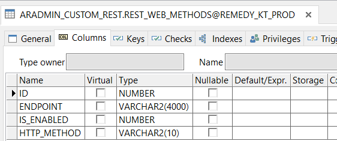
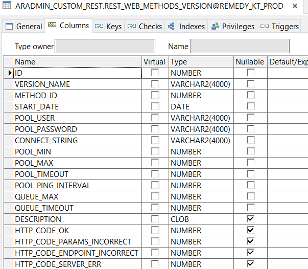
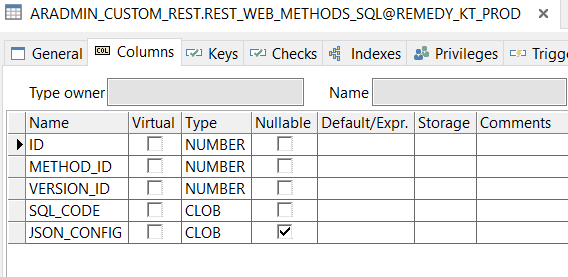
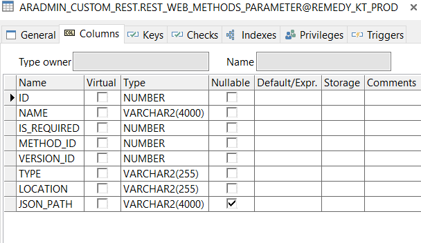

# REST_API_PLATFORM

REST API GATEWAY that helps to make your own REST API methods, that take data from ORACLE database according to custom sql and return it in custom JSON format.
You can also dockerise your application according to the Dockerfile.

Start the app - node index.js(write down your database parameters at the beginning)

go to localhost:3000 and you can create your own API according to the instructions on the additional page

The pass of admin panel is: myApiPass

All you need to do is to create the database structure

Structure consists of 4 tables

